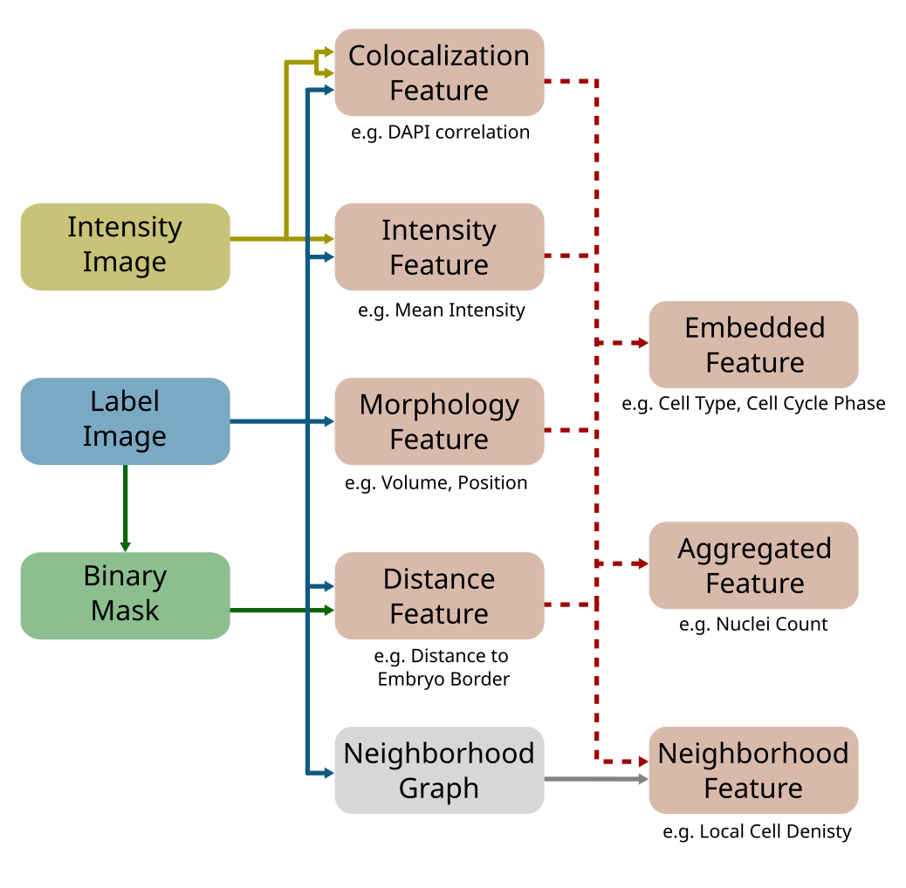

# Features

<figure>
    
    <figcaption>Fig. 1: Overview of the features that are extracted</figcaption>
</figure>

### Index columns
| Element                | Index columns                                                                                 |
| ---------------------- | --------------------------------------------------------------------------------------------- |
| **Data & Annotations** |                                                                                               |
| Intensity image        | `(roi, channel)`                                                                              |
| Label image            | `(roi, structure)`                                                                            |
| Label object           | `(roi, structure, label)`                                                                     |
| **Features**           |                                                                                               |
| Label feature          | `(roi, structure, label)`                                                                     |
| Intensity feature      | `(roi, structure, label, channel[stain.acquistion])`                                          |
| Colocalization feature | `(roi, structure, label, channelPair[channel*channel])`                                       |
| Distance feature       | `(roi, structure, label, objectTo[structure.label])`                                          |
| Neighborhood feature   | `(roi, structure, label, neighborhoodAggregation[neighborhood.distance.aggregationFunction])` |

### List of features
() = implemented but not used  
{} = not yet implemented  
& = expensive to compute

#### **Label Features** (`features.labels.py`)
| Feature                         | Feature Class |   Dimension |     ITK DType |     DType |                Unit |
| ------------------------------- | ------------- | ----------: | ------------: | --------: | ------------------: |
| PhysicalSize                    | Size          |           1 |       `itk.D` | `Float64` | $\mu m^2 / \mu m^3$ |
| (NumberOfPixels)                | Size          |           1 |       `itk.L` |   `Int64` |                $DN$ |
| EquivalentSphericalRadius       | Size          |           1 |       `itk.D` | `Float64` |             $\mu m$ |
| Elongation                      | Shape         |           1 |       `itk.D` | `Float64` |                $DN$ |
| Flatness                        | Shape         |           1 |       `itk.D` | `Float64` |                $DN$ |
| Roundness                       | Shape         |           1 |       `itk.D` | `Float64` |                $DN$ |
| FeretDiameter &                 | Shape         |           1 |       `itk.D` | `Float64` |             $\mu m$ |
| Perimeter &                     | Shape         |           1 |       `itk.D` | `Float64` |   $\mu m / \mu m^2$ |
| (EquivalentSphericalPerimeter)  | Shape         |           1 |       `itk.D` | `Float64` |   $\mu m / \mu m^2$ |
| (NumberOfPixelsOnBoerder)       | Shape         |           1 |       `itk.L` |   `Int64` |                $DN$ |
| (PerimeterOnBorder)             | Shape         |           1 |       `itk.D` | `Float64` |             $\mu m$ |
| PerimeterOnBorderRatio          | Shape         |           1 |       `itk.D` | `Float64` |                $DN$ |
| Centroid                        | Position      |    1 x ndim |   `itk.Point` | `Float64` |                $DN$ |
| PrincipalAxes                   | Orientation   | ndim x ndim |  `itk.Matrix` | `Float64` |                $DN$ |
| (PrincipalMoments)              | Orientation   |    1 x ndim |  `itk.Vector` | `Float64` |                $DN$ |
| EquivalentEllipsoidDiameter     | Orientation   |    1 x ndim |  `itk.Vector` | `Float64` |
| BoundingBox                     | Misc          |    2 x ndim | `itk.Reginon` |   `Int64` |
| OrientedBoundingBoxDirection &  | Misc          | ndim x ndim |  `itk.Matrix` | `Float64` |
| OrientedBoundingBoxOrigin &     | Misc          |    1 x ndim |   `itk.Point` | `Float64` |
| OrientedBoundingBoxSize &       | Misc          |    1 x ndim |  `itk.Vector` | `Float64` |
| (OrientedBoundingBoxVertices) & | Misc          | ndim x ndim |  `itk.Matrix` | `Float64` |

#### **Intensity Features** (`features.intensity.py`)
| Feature                    | Feature Class |   Dimension |    ITK DType |     DType |
| -------------------------- | ------------- | ----------: | -----------: | --------: |
| Mean                       | Distribution  |           1 |      `itk.D` | `Float64` |
| Median                     | Distribution  |           1 |      `itk.D` | `Float64` |
| Minimum                    | Distribution  |           1 |      `itk.D` | `Float64` |
| Maximum                    | Distribution  |           1 |      `itk.D` | `Float64` |
| Sum                        | Distribution  |           1 |      `itk.D` | `Float64` |
| Variance                   | Distribution  |           1 |      `itk.D` | `Float64` |
| StandardDeviation          | Distribution  |           1 |      `itk.D` | `Float64` |
| Skewness                   | Distribution  |           1 |      `itk.D` | `Float64` |
| Kurtosis                   | Distribution  |           1 |      `itk.D` | `Float64` |
| (WeightedElongation)       | Shape         |           1 |      `itk.D` | `Float64` |
| (WeightedFlatness)         | Shape         |           1 |      `itk.D` | `Float64` |
| (CenterOfGravity)          | Position      |    1 x ndim |  `itk.Point` | `Float64` |
| (WeightedPrincipalAxes)    | Orientation   | ndim x ndim | `itk.Matrix` | `Float64` |
| (WeightedPrincipalMoments) | Orientation   |    1 x ndim | `itk.Vector` | `Float64` |
| (MaximumIndex)             | Position      |    1 x ndim |  `itk.Index` |   `Int64` |
| (MinimumIndex)             | Position      |    1 x ndim |  `itk.Index` |   `Int64` |
| {Histogram} &              | Histogram     |      n_bins |              | `Float64` |

#### **Distance Features** (`features.distance.py`)
| Feature                    | Feature Class | Dimension |   ITK DType |     DType |
| -------------------------- | ------------- | --------: | ----------: | --------: |
| CentroidDistance           | Distance      |         1 |     `itk.D` | `Float64` |
| MaximumDistance            | Distance      |         1 |     `itk.D` | `Float64` |
| MinimumDistance            | Distance      |         1 |     `itk.D` | `Float64` |
| (ClosestPixelIndex)        | Position      |  1 x ndim | `itk.Index` |   `Int64` |
| (FurthestPixelIndex)       | Position      |  1 x ndim | `itk.Index` |   `Int64` |
| {DirectionToOtherCentroid} | Orientation   |  1 x ndim |             | `Float64` |

#### **Colocalization** Features (`features.colocalization.py`)
| Feature             | Feature Class  | Dimension |     DType |
| ------------------- | -------------- | --------: | --------: |
| PearsonCorrelation  | Colocalization |         1 | `Float64` |
| SpearmanCorrelation | Colocalization |         1 | `Float64` |
| KendallTau          | Colocalization |         1 | `Float64` |
| {MutualInformation} | Colocalization |         1 | `Float64` |

#### **Density Features** (`features.neighborhood.density.py`)
| Feature            | Feature Class | Neighborhood | Dimension |     DType |
| ------------------ | ------------- | ------------ | --------: | --------: |
| NObjectsInRadiusR  | Density       | Radius       |         1 |   `Int64` |
| DistanceToKClosest | Density       | KNN          |         1 | `Float64` |
| NTouchingKRemoved  | Density       | Touching     |         1 |   `Int64` |

#### **Neighborhoods** (`features.neighborhood.neighborhoods.py`)
| Neighborhood | Query Object | Distance       |
| ------------ | ------------ | -------------- |
| Radius       | KDTree       | Euclidian      |
| KNN          | KDTree       | K-Neighborhood |
| Touch        | TouchMatrix  | K-Removed      |

#### **Aggregation Fuctions** (`features.neighborhood.aggregation_functions.py`)
| Aggregation | Description |
| ----------- | ----------- |
| Mean        |             |
| Median      |             |
| {Mode}      |             |
| Max         |             |
| Min         |             |
| Sum         |             |
| Std         |             |
| Var         |             |
| CircMean    |             |
| CircVar     |             |
| CircR       |             |
