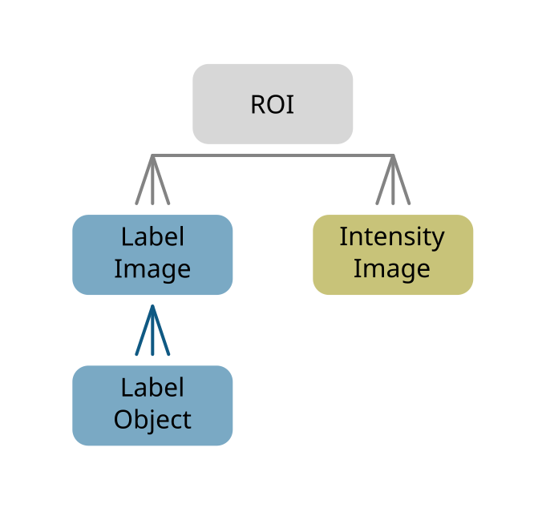
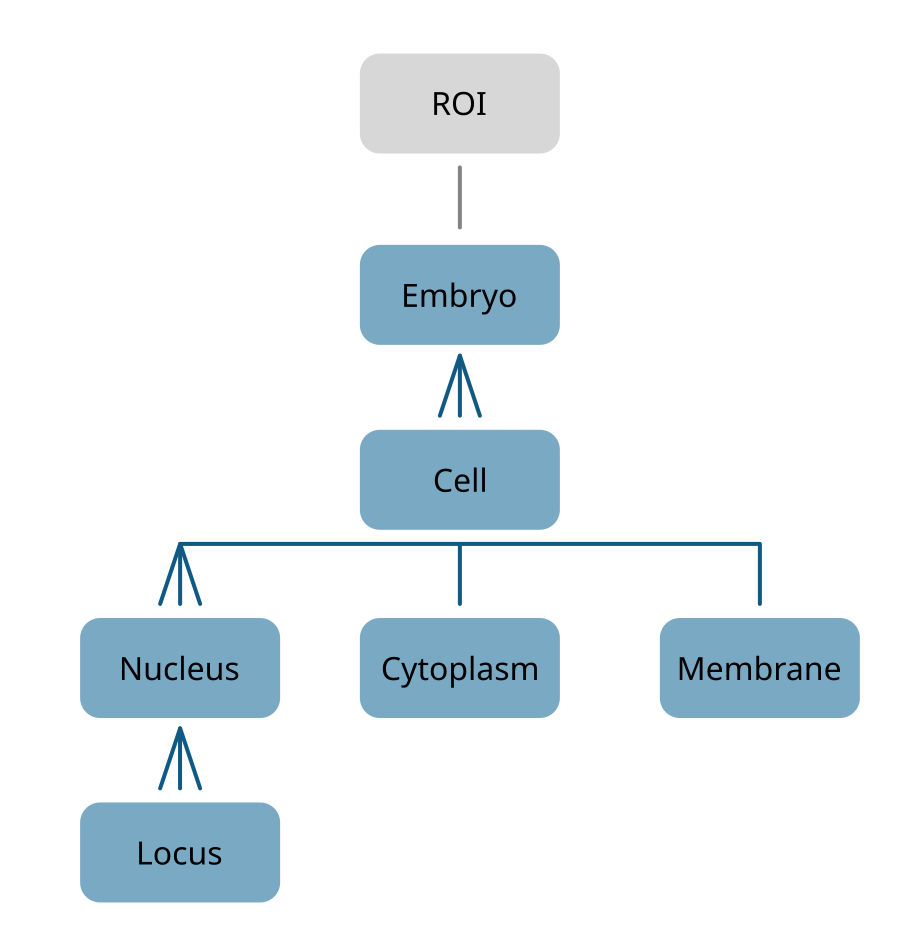

# Index specifications
Specification for index conventions used across this repository.

## Index of Intensity Images, Label Images and Label Objects
<figure>
    
    <figcaption>Fig. 1: Basic layout of the data.</figcaption>
</figure>

* ROI: `(roi, )`
* Intensity Image: 
    - Full ID: `(roi, stain, acquisition)` 
    - Short ID: `(img_id, )` 
* Label Image:
    - Full ID:  `(roi, structure)`
    - Short ID:  `(lbl_id, )`
* Label Object:
    - Full ID: `(roi, structure, label)`
    - Short ID: `(obj_id, )`

## Object hierarchy
<figure>
    
    <figcaption>Fig. 2: Object hierarchy.</figcaption>
</figure>

The following `structure`'s are segmented:
* Embryo: `structure=='emb'`
* Cell: `structure=='cell'`
* Cytoplasm: `structure=='cyto'`
* Membrane: `structure=='mem'`
* Nucleus: `structure=='nuc'`
* Locus: `structure=='locus'`  

The full hierarchical object id is defined as:
`(roi, emb, cell, cyto, mem, nuc, locus)`

## Index of features
<!-- TODO: Figure this out... -->
<figure>
    
    <figcaption>Fig. 3: Feature hierarchy.</figcaption>
</figure>

* Morphology feature:
    - Full ID: `(roi, structure, label)`
    - Short ID: `(obj_id, )`
    - Feature ID: `(mfeature_id, )`
* Intensity feature:
    - Full ID: `(roi, structure, label, stain, acquisition)`
    - Short ID: `(obj_id, img_id)`
    - Feature ID: `(ifeature_id, )`
* Distance feature:
    - Full ID: `(roi, structure, label, structure, label)`
    - Short ID: `(obj_id, obj_id)`
    - Feature ID: `(dfeature_id, )`
* Correlation feature:
    - Full ID: `(roi, structure, label, stain, acquisition, stain, acquisition)`
    - Short ID: `(obj_id, img_id, img_id)`
    - Feature ID: `(cfeature_id, )`
* Neighborhood feature:
    - Feature ID: `(feature_id, nhood, radius)`